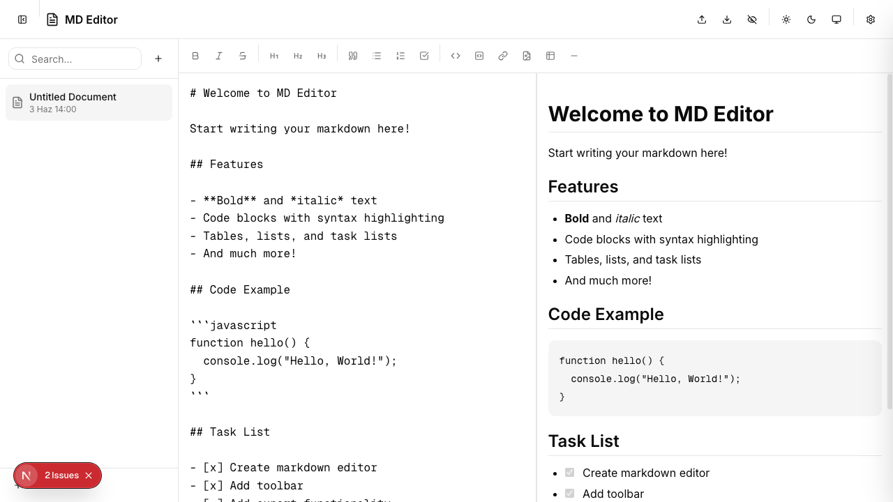

# MD Editor - Professional Markdown Editor

A powerful and elegant markdown editor built with modern web technologies.




## 🚀 Features

### Core Editor
- **Live Markdown Editing** - Write and preview in real-time
- **Keyboard Shortcuts** - Ctrl+B (Bold), Ctrl+I (Italic), Ctrl+K (Link)
- **Syntax Highlighting** - Beautiful code block highlighting
- **Auto-Save** - Never lose your work (configurable interval)

### Formatting Toolbar
- Bold, Italic, Strikethrough
- Headings (H1, H2, H3)
- Quotes, Bullet Lists, Numbered Lists, Task Lists
- Inline Code, Code Blocks
- Links, Images, Tables
- Horizontal Rules

### Document Management
- **Sidebar** - View and manage all documents
- **Search** - Quick document search
- **Rename** - Rename documents via context menu
- **Delete** - Delete documents via context menu (last document protected)
- **Import** - Load .md files from your computer
- **Export** - Download documents as .md files

### Preview Modes
- **Right Panel** - Side-by-side editing and preview
- **Bottom Panel** - Stacked layout
- **Split View** - Equal split
- **Toggle Preview** - Show/hide preview

### Appearance
- **Theme Support** - Light, Dark, and System modes
- **Font Family Selector** - Choose from 4 modern fonts:
  - Inter - Clean, professional sans-serif
  - Plus Jakarta Sans - Modern, elegant
  - Fira Code - Monospace with ligatures
  - JetBrains Mono - Developer-focused monospace
- **Customizable Font Size** - 12px to 24px
- **Adjustable Line Height** - Comfortable reading
- **Word Wrap** - Long lines wrap automatically
- **Spell Check** - Built-in browser spell check

## 🛠️ Tech Stack

| Technology | Version | Purpose |
|------------|---------|---------|
| **Next.js** | 16.2.7 | React framework with App Router |
| **React** | 19 | UI library |
| **TypeScript** | 5 | Type safety |
| **Tailwind CSS** | v4 | Utility-first styling |
| **shadcn/ui** | v4 | UI component library (base-ui) |
| **Lucide React** | latest | Icon system |
| **react-markdown** | 9.x | Markdown rendering |
| **remark-gfm** | 4.x | GitHub Flavored Markdown |
| **rehype-highlight** | 7.x | Syntax highlighting |
| **rehype-raw** | 7.x | Raw HTML in markdown |

## 📁 Project Structure

```
md-editor/
├── src/
│   ├── app/
│   │   ├── page.tsx          # Main editor page
│   │   ├── layout.tsx        # Root layout with providers
│   │   └── globals.css       # Global styles & markdown prose
│   ├── components/
│   │   ├── editor/
│   │   │   ├── markdown-editor.tsx     # Editor textarea
│   │   │   ├── markdown-toolbar.tsx   # Formatting toolbar
│   │   │   ├── markdown-preview.tsx   # Live preview
│   │   │   ├── editor-sidebar.tsx     # Document list
│   │   │   └── settings-dialog.tsx    # Settings panel
│   │   ├── providers/
│   │   │   └── theme-provider.tsx    # Theme context
│   │   └── ui/               # shadcn/ui components
│   ├── hooks/
│   │   ├── use-local-storage.ts       # Persistent state
│   │   └── use-mobile.ts             # Mobile detection
│   ├── lib/
│   │   └── utils.ts                  # Utility functions
│   └── types/
│       └── editor.ts                  # TypeScript types
├── public/
├── package.json
├── tailwind.config.ts
├── tsconfig.json
├── components.json
└── README.md
```

## 🚦 Getting Started

### Prerequisites
- Node.js 18+
- npm or yarn

### Installation

```bash
# Clone or navigate to project
cd ~/Desktop/bbStudio/md-editor

# Install dependencies
npm install

# Start development server
npm run dev

# Build for production
npm run build

# Run linter
npm run lint
```

### Development
```bash
npm run dev
```
Open [http://localhost:3000](http://localhost:3000) to start editing.

## ⌨️ Keyboard Shortcuts

| Shortcut | Action |
|----------|--------|
| `Ctrl + B` | Bold |
| `Ctrl + I` | Italic |
| `Ctrl + K` | Insert Link |
| `Tab` | Indent |
| `Shift + Tab` | Dedent |

## 📝 Markdown Support

### Standard Markdown
- Headings (#, ##, ###)
- Bold (**text**)
- Italic (*text*)
- Strikethrough (~~text~~)
- Links ([text](url))
- Images ()
- Code (`code`)
- Blockquotes (>)
- Lists (-, 1.)
- Horizontal rules (---)

### GitHub Flavored Markdown
- Task lists (- [ ] / - [x])
- Tables
- Fenced code blocks (```)
- Autolinks

### Additional
- Syntax highlighting in code blocks
- Raw HTML support

## 💾 Data Storage

All documents and settings are stored in browser's **localStorage**:
- `md-editor-documents` - Your documents
- `md-editor-settings` - Editor preferences
- `md-editor-theme` - Theme preference

## 🎨 Theme

The editor supports three theme modes:
- **Light** - Clean light interface
- **Dark** - Easy on the eyes
- **System** - Follows system preference

## 📦 Components

Built with shadcn/ui components:
- Button, Input, Textarea
- Dialog, Tooltip, TooltipProvider
- DropdownMenu, Switch, Slider
- ScrollArea, Separator, Skeleton
- Card, Label, Tabs

## 📄 License

MIT License - feel free to use and modify.

---

Built with ❤️ using Next.js, shadcn/ui, and Tailwind CSS
